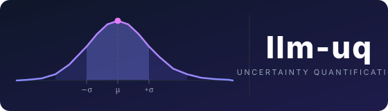

<p align="center">
  
</p>

<p align="center">
  <a href="https://pypi.org/project/llm-uq/"></a>
  <a href="https://pypi.org/project/llm-uq/"></a>
  <a href="https://github.com/tjoliveira/llm-uq"></a>
  <a href="LICENSE"></a>
</p>

<p align="center">
  <b>Uncertainty quantification for language model outputs.</b><br/>
  Six methods &nbsp;·&nbsp; Four tasks &nbsp;·&nbsp; Rigorous metrics &nbsp;·&nbsp; One import.
</p>

---

## Overview

Language models produce fluent text even when they are wrong. **llm-uq** gives you the tools to detect that — by computing, evaluating, and visualising uncertainty scores that track whether a model's output is likely to be correct.

It implements **six uncertainty estimation methods** spanning token probabilities, semantic consistency, and self-reflection, and evaluates them against ground-truth correctness across QA, math, summarisation, and open-ended generation tasks. You get AUROC, ECE, and Spearman correlation so you can measure, not just guess, how well uncertainty tracks actual errors.

---

## Installation

```bash
pip install llm-uq
```

```bash
# With 4-bit / 8-bit quantization support (requires CUDA):
pip install "llm-uq[quantization]"
```

---

## Quickstart

```python
from llm_uq import Estimator, Benchmark, metrics, viz

# ── 1. Load a HuggingFace causal LM ──────────────────────────────────────────
est = Estimator.from_pretrained(
    "Qwen/Qwen3-8B",
    trust_remote_code=True,
    semantic_model="all-MiniLM-L6-v2",  # needed for self_consistency / bsdetector
)

# ── 2. Single-prompt uncertainty ──────────────────────────────────────────────
scores = est.estimate(
    "What is the boiling point of water?",
    methods=["entropy", "max_probability", "sequence_probability"],
)
# {"entropy": 0.43, "max_probability": 0.21, "sequence_probability": 1.87}

# ── 3. All methods including sampling-based ───────────────────────────────────
scores = est.estimate(
    "Who wrote Hamlet?",
    methods=["entropy", "self_consistency", "self_reflection", "bsdetector"],
    num_samples=5,
    max_new_tokens=50,
)
# {"entropy": 0.12, "self_consistency": 0.04, "self_reflection": 0.0, "bsdetector": 0.03}

# ── 4. Token-level breakdown ──────────────────────────────────────────────────
detail = est.score_all("What is the speed of light?", max_new_tokens=30)
print(detail["entropy"]["sentence"])   # mean entropy over generated tokens
print(detail["entropy"]["tokens"])     # per-token entropy list

# ── 5. Benchmark on custom data ───────────────────────────────────────────────
bench = Benchmark(est)
results = bench.run(
    task="qa",
    dataset=[
        {"input": "Who wrote Hamlet?",        "target": "Shakespeare"},
        {"input": "What year did WWII end?",   "target": "1945"},
        {"input": "What is the speed of light in m/s?", "target": "299792458"},
    ],
    methods=["entropy", "self_consistency"],
)

print(results.auroc)   # {"entropy": 0.71, "self_consistency": 0.78}
print(results.ece)     # {"entropy": 0.08, "self_consistency": 0.05}

# ── 6. Benchmark on a built-in dataset ───────────────────────────────────────
results = bench.run(task="qa", dataset="squad", max_samples=100)

# ── 7. Metrics ────────────────────────────────────────────────────────────────
u = results.uncertainties["entropy"]
e = results.errors

print(metrics.auroc(u, e))
print(metrics.ece(u, e))
print(metrics.correlations(u, e))
summary = metrics.summarize(u, e)   # MetricSummary dataclass

# ── 8. Visualisation ──────────────────────────────────────────────────────────
import matplotlib.pyplot as plt

fig, axes = plt.subplots(1, 3, figsize=(15, 4))
viz.roc_curve(u, e, method_name="entropy", ax=axes[0])
viz.calibration_curve(u, e, method_name="entropy", ax=axes[1])
viz.distribution(u, method_name="entropy", ax=axes[2])
plt.tight_layout()
plt.show()
```

> An interactive version of this quickstart is available in [`quickstart.ipynb`](quickstart.ipynb).

---

## Uncertainty Methods

llm-uq implements six methods across two families. All methods return scores where **higher = more uncertain**.

### Probability-based methods

These methods require a single greedy-decode forward pass.

#### Entropy

For each generated token $t$, compute the Shannon entropy over the full vocabulary $\mathcal{V}$:

$$H(t) = -\sum_{v \in \mathcal{V}} p(v \mid \mathbf{x}, \mathbf{y}_{<t}) \log p(v \mid \mathbf{x}, \mathbf{y}_{<t})$$

The sentence-level score is the mean over all $T$ non-EOS tokens:

$$\mathcal{U}_{\text{entropy}}(\mathbf{x}) = \frac{1}{T} \sum_{t=1}^{T} H(t)$$

High entropy at a token means the model is spreading probability mass across many possible next words — a signal of genuine uncertainty.

#### Max Probability

Complements entropy by focusing on the single most likely token:

$$\mathcal{U}_{\text{max\_prob}}(\mathbf{x}) = \frac{1}{T} \sum_{t=1}^{T} \left(1 - \max_{v \in \mathcal{V}}\, p(v \mid \mathbf{x}, \mathbf{y}_{<t})\right)$$

When the model is confident, the maximum probability approaches 1 and the score approaches 0.

#### Sequence Probability

Measures overall generation confidence as the **negative mean log-likelihood** of the produced sequence:

$$\mathcal{U}_{\text{seq\_prob}}(\mathbf{x}) = -\frac{1}{T} \sum_{t=1}^{T} \log p(y_t \mid \mathbf{x}, \mathbf{y}_{<t})$$

This is equivalent to the per-token perplexity in log space. A value of 0 means the model assigned probability 1 to every generated token.

### Sampling-based methods

These methods generate additional outputs and compare them, requiring $N$ extra forward passes.

#### Self-Consistency

Generate $N$ stochastic samples $\{s_1, \ldots, s_N\}$ and measure their **mean semantic distance** from the greedy reference output $y_{\text{ref}}$ using sentence embeddings:

$$\mathcal{U}_{\text{SC}}(\mathbf{x}) = \frac{1}{N} \sum_{i=1}^{N} \left(1 - \frac{\mathbf{e}_{\text{ref}} \cdot \mathbf{e}_i}{\|\mathbf{e}_{\text{ref}}\|\, \|\mathbf{e}_i\|}\right)$$

where $\mathbf{e}_{\text{ref}} = \text{embed}(y_{\text{ref}})$ and $\mathbf{e}_i = \text{embed}(s_i)$. If the model always says the same thing, cosine similarity is 1 and uncertainty is 0. If answers vary wildly, uncertainty is high.

> Requires a `sentence-transformers` model (default: `all-MiniLM-L6-v2`).

#### Self-Reflection

Ask the model to evaluate its own answer via a structured A/B/C prompt:

$$\mathcal{U}_{\text{SR}}(\mathbf{x}) = \begin{cases} 0.0 & \text{model answers A — "I am correct"} \\ 0.5 & \text{model answers C — "I am not sure"} \\ 1.0 & \text{model answers B — "I am incorrect"} \end{cases}$$

This requires only one additional forward pass (1 token generation) and no semantic model.

#### BSDetector

A weighted combination of self-consistency and self-reflection, balancing the complementary strengths of both:

$$\mathcal{U}_{\text{BSD}}(\mathbf{x}) = \beta \cdot \mathcal{U}_{\text{SC}}(\mathbf{x}) + (1 - \beta) \cdot \mathcal{U}_{\text{SR}}(\mathbf{x})$$

The default weight is $\beta = 0.7$, giving more influence to self-consistency. Adjust via the `beta` argument to `bsdetector_score()`.

### Method summary

| Method | Formula | Cost | Semantic model |
|---|---|---|---|
| `entropy` | Mean token $H$ | 1× | No |
| `max_probability` | Mean $1 - \max p$ | 1× | No |
| `sequence_probability` | Negative mean log-prob | 1× | No |
| `self_consistency` | Mean cosine distance | $N$× | **Yes** |
| `self_reflection` | A/B/C → {0, 0.5, 1} | 1× | No |
| `bsdetector` | $\beta \cdot U_{SC} + (1-\beta) \cdot U_{SR}$ | $N{+}1$× | **Yes** |

---

## Supported Tasks

| Task key | Built-in dataset | Scoring |
|---|---|---|
| `"qa"` | SQuAD (`rajpurkar/squad`) | Word-boundary substring match |
| `"math"` | GSM8K (`openai/gsm8k`) | Numerical substring match |
| `"summarization"` | CNN/DailyMail (`abisee/cnn_dailymail`) | ROUGE-L F-measure |
| `"open-ended"` | WritingPrompts (`euclaise/writingprompts`) | Prometheus 2 judge (LLM-as-a-judge) |

```python
# Built-in dataset
results = bench.run(task="qa", dataset="squad", max_samples=100)

# Custom data — list of {"input": ..., "target": ...} dicts
results = bench.run(task="math", dataset=[
    {"input": "If x + 3 = 7, what is x?", "target": "4"},
    {"input": "What is 15% of 200?",       "target": "30"},
])
```

---

## Metrics

### AUROC

Area under the ROC curve, treating uncertainty as the predictor of binary errors:

$$\text{AUROC} = \int_0^1 \text{TPR}(\tau)\, d\,\text{FPR}(\tau)$$

A value of 0.5 is random; 1.0 is perfect. Used primarily for binary tasks (QA, Math).

### ECE

Expected Calibration Error — measures how well confidence tracks accuracy across $B$ equal-width bins:

$$\text{ECE} = \sum_{b=1}^{B} \frac{|B_b|}{n}\, \bigl|\text{acc}(B_b) - \text{conf}(B_b)\bigr|$$

where confidence is $\text{conf}_i = 1 - \hat{\mathcal{U}}_i$ (normalised to $[0,1]$) and accuracy is the fraction of correct predictions in bin $b$. Lower ECE is better; 0 is perfect calibration.

### Rank Correlations

**Spearman** $\rho$ and **Pearson** $r$ measure monotonic/linear alignment between uncertainty and error scores. These are more appropriate than AUROC for continuous error scales (summarisation, open-ended generation).

```python
from llm_uq import metrics

u = results.uncertainties["entropy"]
e = results.errors

# Individual metrics
auroc_score  = metrics.auroc(u, e)
ece_score, _ = metrics.ece(u, e)         # (float, bin_stats_dict)
corr         = metrics.correlations(u, e) # {"pearson": (r, p), "spearman": (r, p)}
stats        = metrics.uncertainty_stats(u)  # mean, std, min, max, median, q25, q75

# All at once
summary = metrics.summarize(u, e)
print(summary.auroc, summary.ece, summary.spearman, summary.error_rate)
```

---

## Visualisation

All plot functions accept an optional `ax=` argument for composing multi-panel figures. When `ax` is omitted, a standalone figure is created (and optionally saved via `save_path`).

```python
from llm_uq import viz
import matplotlib.pyplot as plt

# Apply the default calibra visual theme
viz.set_style()

# ── ROC curve ────────────────────────────────────────────────────────────────
viz.roc_curve(
    uncertainties, errors,
    method_name="entropy",
    save_path="roc.png",   # optional; PNG at 300 dpi
)

# ── Reliability / calibration diagram ────────────────────────────────────────
viz.calibration_curve(
    uncertainties, errors,
    method_name="entropy",
    n_bins=10,
    ece=0.07,              # optional annotation
)

# ── Uncertainty distribution histogram ───────────────────────────────────────
viz.distribution(uncertainties, method_name="entropy")

# ── Uncertainty vs. quality scatter ──────────────────────────────────────────
viz.correlation(uncertainties, quality_scores, method_name="entropy")

# ── Method bar chart ─────────────────────────────────────────────────────────
viz.method_comparison(results.metrics, metric="auroc")

# ── Cross-task grouped bar chart ─────────────────────────────────────────────
viz.task_comparison(
    {"qa": qa_results.metrics, "math": math_results.metrics},
    metric="auroc",
)

# ── Token-level heatmap ───────────────────────────────────────────────────────
viz.token_heatmap(
    token_uncertainties=results.token_level["entropy"]["uncertainties"],
    tokens=results.token_level["entropy"]["tokens"],
    method_name="entropy",
    max_samples=10,
)

# ── Multi-panel composition ───────────────────────────────────────────────────
fig, axes = plt.subplots(1, 3, figsize=(15, 4))
viz.roc_curve(u, e, ax=axes[0])
viz.calibration_curve(u, e, ax=axes[1])
viz.distribution(u, ax=axes[2])
plt.tight_layout()
plt.savefig("overview.png", dpi=300)
```

---

## Advanced Usage

### Quantization

Run large models on consumer hardware with bitsandbytes:

```python
# 4-bit — smallest memory footprint
est = Estimator.from_pretrained(
    "Qwen/Qwen3-8B",
    load_in_4bit=True,
    trust_remote_code=True,
)

# 8-bit — better quality/size trade-off
est = Estimator.from_pretrained(
    "Qwen/Qwen3-8B",
    load_in_8bit=True,
    trust_remote_code=True,
)
```

Requires a CUDA GPU and `pip install "llm-uq[quantization]"`.

### Token-level uncertainty

`score_all()` returns token-level data for the probability-based methods alongside sentence-level scores:

```python
detail = est.score_all(
    "What is the capital of Australia?",
    max_new_tokens=30,
    num_samples=5,
)

# Probability-based — dict with "sentence" and "tokens" keys
detail["entropy"]["sentence"]        # float: mean entropy
detail["entropy"]["tokens"]          # list[float]: per-token entropy
detail["max_probability"]["tokens"]  # list[float]: per-token 1 − max(p)

# Sampling-based — plain float
detail["self_consistency"]           # float
detail["bsdetector"]                 # float
```

### Semantic model configuration

`self_consistency` and `bsdetector` require a sentence-transformers model:

```python
# Default — all-MiniLM-L6-v2 (fast, ~80 MB)
est = Estimator.from_pretrained("Qwen/Qwen3-8B", semantic_model="all-MiniLM-L6-v2")

# Multilingual tasks
est = Estimator.from_pretrained(
    "Qwen/Qwen3-8B",
    semantic_model="paraphrase-multilingual-mpnet-base-v2",
)

# Disable to skip self_consistency / bsdetector entirely
est = Estimator.from_pretrained("Qwen/Qwen3-8B", semantic_model=None)
```

### Saving and loading results

```python
# Save to JSON
results.to_json("results/squad_qwen3_8b.json")

# Inspect as a dict
d = results.to_dict()
```

### Controlling generation

```python
scores = est.estimate(
    prompt,
    methods=["self_consistency", "bsdetector"],
    max_new_tokens=100,    # tokens to generate per sample
    temperature=0.8,       # sampling temperature (sampling-based methods)
    num_samples=10,        # number of stochastic samples
)
```

---

## Research

The `experiments/` directory contains the configuration and runner used in the accompanying study ([`REPORT.md`](REPORT.md)). Pre-computed results for Qwen3-8B, Qwen3-4B, and Ministral-8B are in `results/`.

```bash
# Re-run experiments (GPU required, ~1–2 hours per model)
python experiments/run_experiments.py --config experiments/configs/qwen3_8b.yaml

# Re-generate results tables from saved JSON
python scripts/extract_results_table.py
python scripts/extract_latency_quality_tradeoff.py
```

---

## Development

```bash
git clone https://github.com/tjoliveira/llm-uq
cd llm-uq
pip install -e ".[dev]"
pytest tests/
```

---

## Documentation

Full usage guide with additional examples: [`docs/usage.md`](docs/usage.md)

Interactive notebook: [`quickstart.ipynb`](quickstart.ipynb)

---

## License

Apache 2.0 — see [`LICENSE`](LICENSE).
